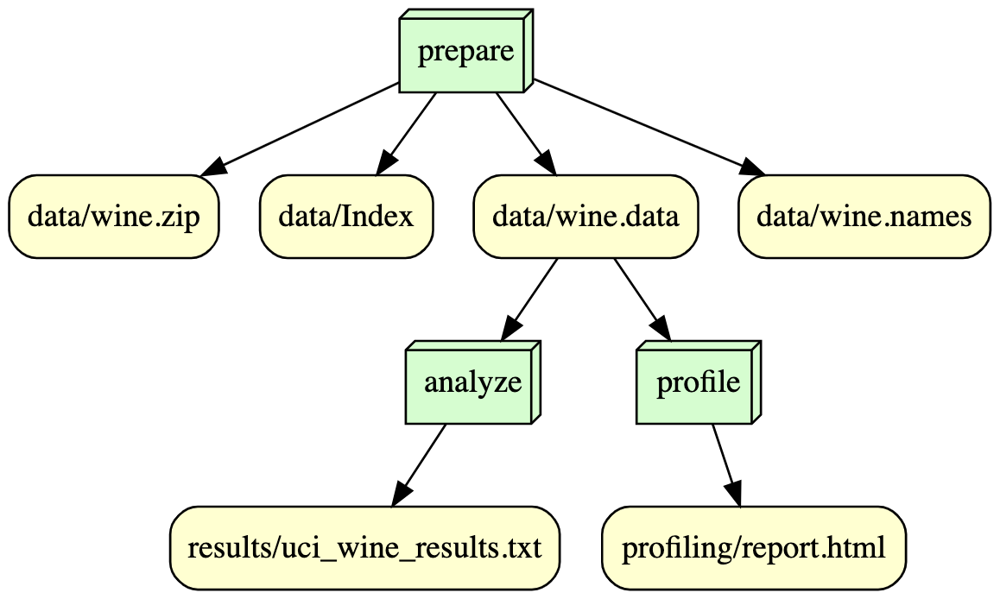

# is477-fall2023-final-project

Public repository for IS477 Fall 2023 final project

## Overview
- **Purpose**: is477-fall2023-final-project is Github repository for the final project of IS 477 Data Management class. The project is about creating the pipeline or the entire process of data management, such as acquisition of data, check integrity of data, data analysis, preservation, legal concerns, and reproduce of data and analysis. 
- **Overall project requirements**: The project requires basic installation of GitHub, Docker, VScode, and GitHub accounts with repositories for the final project of IS 477. 
- **Dataset**: The dataset used for this project is from UC Irvine Machine Learning Repository (https://archive.ics.uci.edu/), and the dataset is Wine dataset (https://doi.org/10.24432/C5PC7J). Wine dataset contains total 14 columns that consist of 13 features and 1 target variable for classification purpose. The dataset has total 178 rows, or instances. Wine dataset has Creative Commons Attribution 4.0 International (CC BY 4.0)license, which allow users share and adopt of the dataset with any purpose if appropriate credit is given.
- **Analysis**: The purpose of the analysis is figuring out which machine learning classification model showing a best classification of quality of wine that based on 3 classes. The dataframe splitted into target variable (y) and features (X), and then splitted more into train X and y for select classfication model based on metrics scores and test X and y for give final evaluation on the selected classfication model. All models are standard scaled and Grid Searched with 5 fold corss validations to figuring out best parameters with less overfitting for each models.

## Contributions

- Jung, Changho: Creating and finishing the files in data folder, results folder and script folder. Checking and revsing the rest of the files in the project.

- Wen, Dongjing : Creating and finishing the README.md, requirement.txt, snakefile, environment.log, .gitgnore, zenodo.jason, profiling files. CO-finishing the data folder. Checking and revising the files in results folder and script folder.

## Analysis
1. From the applying the train dataset, Logistic Regression showed the best accuracy score: 1. Therefore, Logistic Regression is selected for the final application for classification.
2. Then, the selected model, Logistic Regression is fitted with test X and y for the final evaluation of the model. To evaluate the model with slightly more detailed, confusion matrix with metrics like accuracy, precision, and recall used. Logistic Regression showed all correct, 100% accuracy, precision, and recall with no negatives or error in confusion matrix. 
- **Result**: Logistic Regression showed the best performance to classifying wine quality class according to the analysis, compare to Decision Tree and Random Forest. However, since the dataset contains only 178 instances, considering this analysis as no more than performance purposes and may be further works needed for applying to the work place.

## Workflow

- The overall workflow consist of 3 steps. Step 1 is preparing data, step 2 is profiling dataframe from the data from step 1, and step 3 is analyzing from the data from step 1.

## Reproducing
- All the code in the program need the python environment of Python 3.11.~ (but Python 3.10 also works fine)
- First, download or clone this repository from Github and unzip if your downloaded as zip file.
- Then, reproduce methods can divided into two: Docker and environment.log

### If you are using Docker
- *change username to your docker username. If username is "**kiminfo04**", it will be: **docker run --rm -v ${PWD}:/is477 kiminfo04/is477-fall2023:final-project python scripts/prepare_data.py***
- Type following command in order for run in Docker:
1. For **acquiring** and check **integrity** of data: docker run --rm -v ${PWD}:/is477 username/is477-fall2023:final-project python scripts/prepare_data.py
2. For **profiling data**: docker run --rm -v ${PWD}:/is477 username/is477-fall2023:final-project python scripts/reproduce_adult.py
3. For **analyzing data**: docker run --rm -v ${PWD}:/is477 username/is477-fall2023:final-project python scripts/reproduce_reconstructed.py

### If you are using enivornment.log

## License
- Creative Commons CCZero (CC0-1.0) for the license.
- Characteristic: No Copyright, Global Applicability, Freedom to Use.
- It is a very good license to the project, because it provides the neccessary part of it

## References
- Aeberhard,Stefan and Forina,M.. (1991). Wine. UCI Machine Learning Repository. https://doi.org/10.24432/C5PC7J.
- Dalpiaz, D. (2023a, October). CS 307: Week 08. CS 307 MLDS - CS 307: Week 08. https://cs307.org/notes/week-08/week-08.html 
- Dalpiaz, D. (2023b, October). CS 307: Week 09. CS 307 MLDS - CS 307: Week 09. https://cs307.org/notes/week-09/week-09.html 
- Dalpiaz, D. (2023c, October). Lab 05: Building a pitch classifier. CS 307 MLDS - Lab 05: Building a Pitch Classifier. https://cs307.org/lab/lab-05/lab-05.html 
- Dalpiaz, D. (2023d, October). Lab 06: Building A fraud detector. CS 307 MLDS - Lab 06: Building a Fraud Detector. https://cs307.org/lab/lab-06/lab-06.html 
- Dalpiaz, D. (2023e, November). Lab 08: MLB swing probability model. CS 307 MLDS - Lab 08: MLB Swing Probability Model. https://cs307.org/lab/lab-08/lab-08.html 
- IS 477. (2023). dag.py. Canvas. program documentation. Retrieved November 30, 2023, from https://canvas.illinois.edu/courses/38697/files/10273684/download?download_frd=1. 